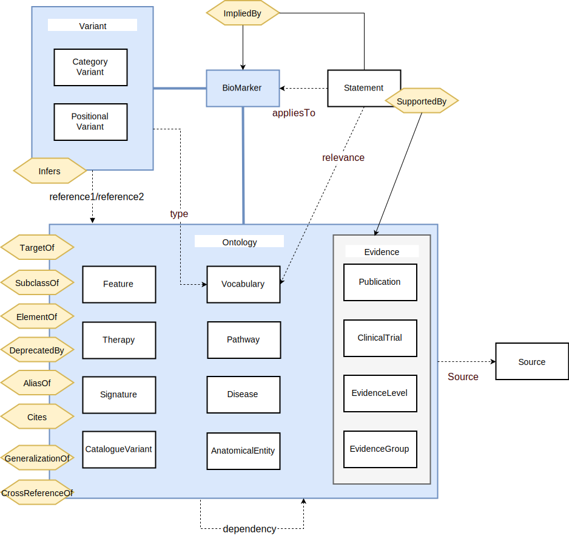

# Knowledgebase Schema

This is the package which defines the schema logic used to create the database, build the API and GUI.
It is a dependency of both the API and GUI and uses the parser package.

This is where all database constraints and swagger metadata associated with a particular database
model is defined



## Deployment

This package is installed on our local npm server. To install simply add to your package.json as you
would with any other package and supply the registry argument to npm install

See the [wiki guide](https://www.bcgsc.ca/wiki/pages/viewpage.action?pageId=60496081#LocalPackageServers(pipandnpm)-Installing) on installing from our local package server.

## Getting Started

See the wiki guide on installing from our loca

Install the dependencies (the parser dependency requires pointing to our local registry)

```bash
npm install --registry http://npm.bcgsc.ca:8080
```

Then run the tests

```bash
npm run test
```

## Using with OrientJS

To avoid requiring orientjs in this package, the RID class is defaulted to the builtin String class.
It is expected that if you want your RID strings cast to RID objects (orientjs.RID) that you will patch
this after import. For example

```javascript
const {RID} = require('orientjs');
const {constants, schema: SCHEMA_DEFN} = require('@bcgsc/knowledgebase-schema');

const {PERMISSIONS} = constants;

constants.RID = RID; // IMPORTANT: Without this all castToRID will do is convert to a string
```